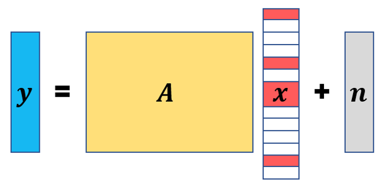
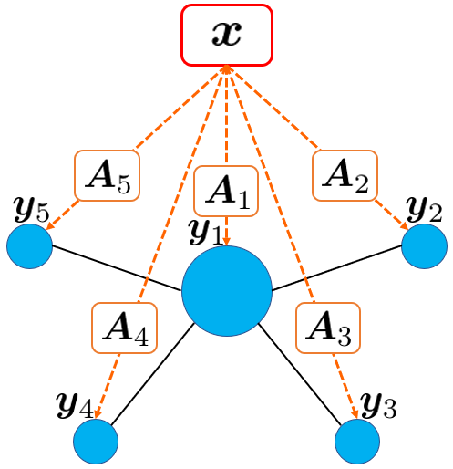
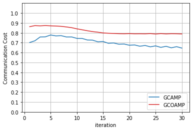
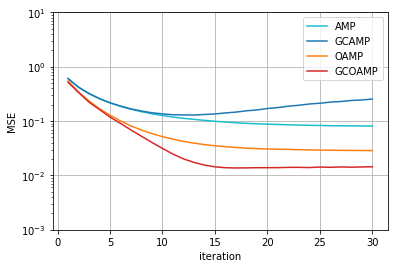

<!--
paginate: true
-->

<!--
_class: title
-->
# 進捗報告
## 分散圧縮センシング

### 久永 健
#### 2021-12-27
<!-- 
[Ctrl] + [Alt] + [Shift] + [i]
で"Insert Date String"を用いて年月日を挿入できる. 
-->

---
# もくじ

1. 提案手法(DOAMP)の検証と解明
2. 完全な分散圧縮センシングへの拡張
3. 今後の課題

---
# 圧縮センシング
<!--
_class: split
_header: '提案手法(DOAMP)の検証と解明'
-->

## 
原信号$\bm{x}$を観測信号$\bm{y} = \bm{Ax} + \bm{n}$から
復元する問題. 

- 原信号: $\bm{x} \in \mathbb{R}^N$ 
- 観測行列: $\bm{A} \in \mathbb{R}^{M \times N} (M < N)$
- 観測信号: $\bm{y} \in \mathbb{R}^M$
- 観測雑音: $\bm{n} \in \mathbb{R}^M \sim \mathcal{N}(0, \sigma^2 \bm{I})$
	- 信号雑音比: $\mathrm{SNR} = \frac{\mathrm{E\{\|\bm{Ax}\|_2^2\}}}{\mathrm{E\{\|\bm{n}\|_2^2\}}}$

##

---
# 分散圧縮センシング
<!--
_class: split
_header: '提案手法(DOAMP)の検証と解明'
-->

$P$個の観測ノードで原信号を観測し, 
各観測信号$\bm{y}_p = \bm{A}_p \bm{x} + \bm{n}_p$をもとに
復元する問題. 

- 観測行列: $\bm{A}_p \in \mathbb{R}^{M_p \times N}$
- 観測信号: $\bm{y}_p \in \mathbb{R}^{M_p}$
- 観測雑音: $\bm{n}_p \in \mathbb{R}^{M_p} \sim \mathcal{N}(0, \sigma_p^2 \bm{I})$
	- 信号雑音比: $\mathrm{SNR} = \frac{\mathrm{E\{\|\bm{A}_p \bm{x}\|_2^2\}}}{\mathrm{E\{\|\bm{n}_p\|_2^2\}}}$
$$\left[\begin{array}{ll}
	\bm{y}_1 \\
	\vdots \\
	\bm{y}_P
\end{array} \right] =
\left[\begin{array}{ll}
	\bm{A}_1 \\
	\vdots \\
	\bm{A}_P
\end{array} \right]
\bm{x} + 
\left[\begin{array}{ll}
	\bm{n}_1 \\
	\vdots \\
	\bm{n}_P
\end{array} \right]$$

- 周辺ノード: 観測, 簡単な計算を行う
- 中央ノード: 周辺ノードから計算結果を集約し, 再構成解の更新を行う

---
# DOAMP
<!-- 
_class: split
_header: '提案手法(DOAMP)の検証と解明'
-->

## 更新式
- $\bm{r}_p^t = \bm{y}_p - \bm{A}_p \bm{s}^t$
- $\bm{w}_p^t = \frac{\bm{s}^t}{P} + \bm{W}_p^t \bm{r}_p^t$
- $\bm{s}^{t+1} = \eta_\mathrm{df}(\sum_{p=1}^P \bm{w}_p^t; \tau_t)$
- $\bm{s}^\mathrm{out} = \eta_\mathrm{out}(\sum_{p=1}^P \bm{w}_p^\mathrm{last}; \tau_\mathrm{last})$

$\bm{W}_p^t$は再構成で用いる行列
$\eta_\mathrm{df}$はDivergence-Free関数

## 状態発展法
- $\tau_t^2 = \sum_{p=1}^P \tau_t^2[p]$
- $\tau_t^2[p] = \frac{1}{N} \{\mathrm{tr}(\bm{B}^t \bm{B}^{t \mathsf{T}})v_t^2[p] + \mathrm{tr}(\bm{W}^t \bm{W}^{t \mathsf{T}}) \}$

- $v_t^2 = \max(\sum_{p=1}^P v_t^2[p], \epsilon)$
- $v_t^2[p] = \frac{\|\bm{y}_p - \bm{A}_p \bm{s}^t\|_2^2 - M \sigma_p^2}{\mathrm{tr}(\bm{A}^\mathsf{T}\bm{A})}$

$\epsilon$は正の微小な定数
$\bm{B}^t = \bm{I} - \bm{W}^t \bm{A}$

---
# 数値シミュレーション(i.i.d.ガウス行列)
<!-- 
_class: split
_header: '提案手法(DOAMP)の検証と解明'
-->

## 通信コスト比

## 平均二乗誤差

---
# 課題
<!-- 
_class: page
_header: '提案手法(DOAMP)の検証と解明'
-->

通信コストを削減するために近似値で再構成しているのに, **DOAMP $>$ OAMP**
- 分散化したことで各観測信号に加わる雑音の分散$\sigma_p^2$が小さい. $SNR = \frac{\mathrm{E\{\|\bm{Ax}\|_2^2\}}}{\mathrm{E\{\|\bm{n}\|_2^2\}}}$
- $\sigma_p^2 \rightarrow 0$のとき, DOAMP $<$ OAMP (近似の影響が考えられる.)
- 各$\sigma_p^2$と$\sigma^2$は異なる値であるため, 厳密に平等な設定で行われているわけではない. 
	- SITA2021の際にも, この点に関する言及をいただいた. 

各$\sigma_p^2$を制御できるようなプログラムに置き換える. 
- DOAMPに対して, $\sigma^2 = \sigma_p^2 ~~~ (p = 1, \cdots, P)$として実験を行う. 
- OAMPに対して, 観測信号を擬似的に分散化して$\sigma^2 = \sum_{p=1}^P \sigma_p^2$で実験を行う. 

---
# 展望
<!--
_class: page
_header: '完全な分散圧縮センシングへの拡張'
_footer: '[1] 林 直樹, 永原 正章, "超スマート社会を支える分散スパースモデリング ー マルチエージェントネットワーク上のビッグデータ解析," IEICE Fundamentals Review, vol. 13, no. 2, pp. 95-107, 2019, Oct.   [2] R. Hayakawa, A. Nakai and K. Hayashi, ”Distributed Approximate Message Passing with Summation Propagation,” 2018 IEEE International Conference on Acoustics, Speech and Signal Processing (ICASSP), Calgary, AB, 2018, pp. 4104-4108.   [3] D. Ito, S. Takabe and T. Wadayama, "Trainable ISTA for Sparse Signal Recovery," in IEEE Transactions on Signal Processing, vol. 67, no. 12, pp. 3113-3125, 15 June15, 2019, doi: 10.1109/TSP.2019.2912879.'
-->
- ある一つの観測ノード(中央ノード)に再構成解を更新させる問題を扱っている. 
	- これは完全に分散化したもの(すべての観測ノードが再構成を行う)ではない. 

- 2021年はDOAMP一辺倒で, どこか一つ躓いたら一気に詰まってしまっていた. 
	- 完全な分散圧縮センシング[1, 2]に対して同時並行に近い形で作業を進める. 
	- 近しいテーマに取り組むことで作業の鈍化を防ぐ. 
	- より応用的な実験(画像の再構成)や深層展開[3]にも取り組んでいきたい. 

---
# 今後の課題
<!--
_class: page
_footer: '[4] D. L. Donoho, A. Maleki, and A. Montanari, “Message-passing algorithms for compressed sensing,” Proceedings of the National Academy of Sciences, vol. 106, pp. 18914–18919, Oct 2009.   [5] J. Ma and L. Ping, “Orthogonal amp,” IEEE Access, vol. 5, pp. 2020–2033, 2017.   [6] P. Han, R. Niu, M. Ren, and Y. C. Eldar, “Distributed approximate message passing for sparse signal recovery,” in 2014 IEEE Global Conferenceon Signal and Information Processing (GlobalSIP),pp. 497–501, 2014.'
-->

- 実験に用いるための自作モジュールの作成
- AMP[4], OAMP[5], DAMP[6]を再度見直す. 
- 以下への対応
	- 完全な分散圧縮センシングへの拡張
	- 画像の再構成などのより応用的な実験
	- 深層展開