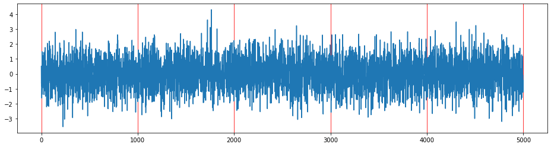

<!--
paginate: true
-->

<!--
_class: title
-->
# 進捗報告
## 分散圧縮センシング

### 久永 健
#### 2022-01-17
<!-- 
[Ctrl] + [Alt] + [Shift] + [i]
で"Insert Date String"を用いて年月日を挿入できる. 
-->

---
# もくじ

1. 提案手法(DOAMP)の検証と解明
2. 完全な分散圧縮センシングへの拡張
3. 今後の課題

---
# 圧縮センシング
<!--
_class: split
_header: '提案手法(DOAMP)の検証と解明'
-->

## 

原信号$\bm{x}$を観測信号$\bm{y} = \bm{Ax} + \bm{n}$から
復元する問題. 

- 原信号: $\bm{x} \in \mathbb{R}^N$ 
- 観測行列: $\bm{A} \in \mathbb{R}^{M \times N} (M < N)$
- 観測信号: $\bm{y} \in \mathbb{R}^M$
- 観測雑音: $\bm{n} \in \mathbb{R}^M \sim \mathcal{N}(\bm{0}, \sigma^2 \bm{I})$

- 方程式の数 $M<$ 変数の数$N$
- 劣決定な連立一次方程式は解$\bm{x}$を 一意に定められない
- $\bm{x}$が**疎**であるなら,  精度の高い推定解$\hat{\bm{x}}$を得られる

---
# 分散圧縮センシング
<!--
_class: split
_header: '提案手法(DOAMP)の検証と解明'
-->

## 

$P$個の観測ノードで原信号を観測し, 
各観測信号$\bm{y}_p = \bm{A}_p \bm{x} + \bm{n}_p$をもとに
復元する問題. 

- 観測行列: $\bm{A}_p \in \mathbb{R}^{M_p \times N}$
- 観測信号: $\bm{y}_p \in \mathbb{R}^{M_p}$
- 観測雑音: $\bm{n}_p \in \mathbb{R}^{M_p} \sim \mathcal{N}(0, \sigma_p^2 \bm{I})$
	
$$\left[\begin{array}{ll}
	\bm{y}_1 \\
	\vdots \\
	\bm{y}_P
\end{array} \right] =
\left[\begin{array}{ll}
	\bm{A}_1 \\
	\vdots \\
	\bm{A}_P
\end{array} \right]
\bm{x} + 
\left[\begin{array}{ll}
	\bm{n}_1 \\
	\vdots \\
	\bm{n}_P
\end{array} \right]$$

- 周辺ノード: 観測, 簡単な計算を行う
- 中央ノード: 周辺ノードから計算結果を集約し, 再構成解の更新を行う

---
# DOAMP
<!-- 
_class: split
_header: '提案手法(DOAMP)の検証と解明'
-->

## 更新式
- $\bm{r}_p^t = \bm{y}_p - \bm{A}_p \bm{s}^t$
- $\bm{w}_p^t = \frac{\bm{s}^t}{P} + \bm{W}_p^t \bm{r}_p^t$
- $\bm{s}^{t+1} = \eta_\mathrm{df}(\sum_{p=1}^P \bm{w}_p^t; \hat{\tau}_t)$
- $\bm{s}^\mathrm{out} = \eta_\mathrm{out}(\sum_{p=1}^P \bm{w}_p^\mathrm{last}; \hat{\tau}_\mathrm{last})$

Divergence-Free関数
$$\eta_\mathrm{df}(\bm{r}; \lambda) = C(\eta_\mathrm{soft}(\bm{r}; \lambda) - \mathrm{E}\{\eta_\mathrm{soft}'(\bm{r}; \lambda)\} \cdot \bm{r})$$

関数$\eta_\mathrm{out}$は最終ステップで用いる関数
※ $\eta_\mathrm{df}$でなくともよい

## 更新で用いる行列
- $\bm{W} = \frac{N}{\mathrm{tr}(\hat{\bm{W}}\bm{A})} \hat{\bm{W}}$
- $\bm{W} = [\bm{W}_1, \cdots, \bm{W}_P]$

## 状態発展法
- $\hat{\tau}_t^2 = \frac{1}{N} \{\|\bm{B}^t\|_\mathrm{F}^2 \hat{v}_t^2 + \|\bm{W}^t\|_\mathrm{F}^2 \sigma^2 \}$
- $\hat{v}_t^2 = \max(\frac{\|\bm{y} - \bm{A} \bm{s}^t\|_2^2 - M \sigma^2}{\|\bm{A}\|_\mathrm{F}^2}, \epsilon)$
	$\epsilon$は正の微小な定数
	$\bm{B}^t = \bm{I} - \bm{W}^t \bm{A}$
	

---
# DOAMP
<!-- 
_class: split
_header: '提案手法(DOAMP)の検証と解明'
-->

## 信号雑音比

- 非分散環境: $\mathrm{SNR} = \frac{\mathrm{E}\{\|\bm{Ax}\|_2^2\}}{\mathrm{E}\{\|\bm{n}\|_2^2\}}$
- 分散環境: $\mathrm{SNR}_p = \frac{\mathrm{E}\{\|\bm{A}_p \bm{x}\|_2^2\}}{\mathrm{E}\{\|\bm{n}_p\|_2^2\}}$

	$\mathrm{E}\{\|\bm{Ax}\|_2^2\} = \sum_{p=1}^P \mathrm{E}\{\|\bm{A}_p \bm{x}\|_2^2\}$

	$\mathrm{E}\{\|\bm{n}\|_2^2\} \approx \mathrm{E}\{\|\bm{n}\|_2^2\}$

	つまり, $\mathrm{SNR} \approx \sum_{p=1}^P \mathrm{SNR}_p$

## 状態発展法(各観測ノード$p$)

- $\hat{\tau}_t^2[p] = \frac{1}{N} \{\|\bm{B}_p^t\|_\mathrm{F}^2 \hat{v}_t^2[p] + \|\bm{W}_p^t\|_\mathrm{F}^2 \sigma_p^2 \}$
- $\hat{v}_t^2[p] = \max(\frac{\|\bm{y}_p - \bm{A}_p \bm{s}^t\|_2^2 - M_p \sigma_p^2}{\|\bm{A}_p\|_\mathrm{F}^2}, \epsilon)$
	$\epsilon$は正の微小な定数
	$\bm{B}_p^t = \bm{I} - \bm{W}_p^t \bm{A}_p$

---
# GCOAMP
<!-- 
_class: split
_header: '提案手法(DOAMP)の検証と解明'
-->

1. 各ノードの閾値$\hat{\tau}_t^2[p]$を基準に, 超過する絶対値を持つ成分のみを通信で中央ノードと共有

2. $n$ごとに集約した成分の総和$z[n]$を用いて各$n$の判定値$D[n]$を計算し, 判定値が仮の閾値$\hat{\gamma}_t[n]$を超える$n$の成分を各ノードに要求

3. 

4. 

5. 

---
# 数値実験
<!--
_class: page
_header: '完全な分散圧縮センシングへの拡張'
-->

---
# 今後の課題
<!--
_class: page
-->

- 実験に用いるための自作モジュールの作成
- AMP[4], OAMP[5], DAMP[6]を再度見直す. 
- 以下への対応
	- 完全な分散圧縮センシングへの拡張
	- 画像の再構成などのより応用的な実験
	- 深層展開