<!--
paginate: true
-->

<!--
_class: title
-->
# 進捗報告
## 分散圧縮センシングの修正と実験

### 久永 健
#### 2022-07-28
<!-- 
[Ctrl] + [Alt] + [Shift] + [i]
で"Insert Date String"を用いて年月日を挿入できる. 
-->

---
# もくじ

1. 提案手法(DOAMP)の検証と解明
2. 数値シミュレーション
3. 今後の課題

---
# 圧縮センシング
<!--
_class: split
_header: '提案手法(DOAMP)の検証と解明'
-->

## 

原信号 $\bm{x}$を観測信号 $\bm{y} = \bm{Ax} + \bm{n}$から
復元する問題. 

- 原信号: $\bm{x} \in \mathbb{R}^N$ 
- 観測行列: $\bm{A} \in \mathbb{R}^{M \times N} (M < N)$
- 観測信号: $\bm{y} \in \mathbb{R}^M$
- 観測雑音: $\bm{n} \in \mathbb{R}^M \sim \mathcal{N}(\bm{0}, \sigma^2 \bm{I})$

劣決定な連立一次方程式の解は無限個

$$||$$

$~~~~~~~~~$ 解$\bm{x}$を一意に定められない

   

$\bm{x}$が**疎**であるなら,  精度の高い推定解$\hat{\bm{x}}$を得られる

---
# 分散圧縮センシング
<!--
_class: split
_header: '提案手法(DOAMP)の検証と解明'
-->

## 

$P$個の観測ノードで原信号を観測し, 
各観測信号$\bm{y}_p = \bm{A}_p \bm{x} + \bm{n}_p$をもとに
復元する問題. 

- 観測行列: $\bm{A}_p \in \mathbb{R}^{M_p \times N}$
- 観測信号: $\bm{y}_p \in \mathbb{R}^{M_p}$
- 観測雑音: $\bm{n}_p \in \mathbb{R}^{M_p} \sim \mathcal{N}(0, \sigma_p^2 \bm{I})$
	
$$\left[\begin{array}{ll}
	\bm{y}_1 \\
	\vdots \\
	\bm{y}_P
\end{array} \right] =
\left[\begin{array}{ll}
	\bm{A}_1 \\
	\vdots \\
	\bm{A}_P
\end{array} \right]
\bm{x} + 
\left[\begin{array}{ll}
	\bm{n}_1 \\
	\vdots \\
	\bm{n}_P
\end{array} \right]$$

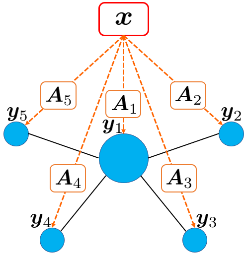

- 周辺ノード: 観測, 簡単な計算を行う
- 中央ノード: 周辺ノードから計算結果を集約し, 再構成解の更新を行う

---
# 分散圧縮センシング
<!--
_class: split
-->

## 信号雑音比率

### 非分散環境
$$\mathrm{SNR} = \frac{\mathrm{E}\{\|\bm{Ax}\|_2^2\}}{\mathrm{E}\{\|\bm{n}\|_2^2\}} = \frac{\sigma_{\bm{Ax}}^2}{\sigma^2}$$

$$\because \mathrm{E}\{\|\bm{Ax}\|_2^2\} = M \sigma_{\bm{Ax}}^2, ~~~~~ \mathrm{E}\{\|\bm{n}\|_2^2\} = M \sigma^2$$

### 分散環境
$$\mathrm{SNR}_p = \frac{\mathrm{E}\{\|\bm{A}_p\bm{x}\|_2^2\}}{\mathrm{E}\{\|\bm{n}_p\|_2^2\}} = \frac{\sigma_{\bm{A}_p\bm{x}}^2}{\sigma_p^2}$$

$$\because \mathrm{E}\{\|\bm{A}_p\bm{x}\|_2^2\} = M_p \sigma_{\bm{A}_p\bm{x}}^2, ~~~~~ \mathrm{E}\{\|\bm{n}_p\|_2^2\} = M_p \sigma_p^2$$

$$\mathrm{SNR} = \mathrm{SNR}_p ~~~~~ \because \sigma_{\bm{Ax}}^2 = \sigma_{\bm{A}_p\bm{x}}^2, \sigma^2 = \sigma_p^2$$

$P << M$の場合, 以下が成り立つ.
$$\sigma_{\bm{A}_p\bm{x}}^2 \approx \hat{\sigma}_{\bm{A}_p\bm{x}}^2 := \frac{\sum_{j=1}^{M_p}(A_px[j]-\mathrm{E}\{\bm{A}_p\bm{x}\})^2}{M_p}$$

$$\sigma_p^2 \approx \hat{\sigma}_p^2 := \frac{\sum_{j=1}^{M_p}(n_p[j]-\mathrm{E}\{\bm{n}_p\})^2}{M_p}$$

### 再構成における観測雑音
代表値$\sigma_{\mathrm{rep}}^2$を以下のように定義する.
$$\sigma_{\mathrm{rep}}^2 = \mathrm{E}\{\hat{\sigma}_p^2\}$$

---
# OAMP
<!-- 
_class: split
_header: '提案手法(DOAMP)の検証と解明'
-->

## 更新式
- $\bm{r}^t = \bm{y} - \bm{A} \bm{s}^t$
- $\bm{w}^t = \bm{s}^t + \bm{W}^t \bm{r}^t$
- $\bm{s}^{t+1} = \eta_\mathrm{df}(\bm{w}^t; \hat{\tau}_t)$
- $\bm{s}^\mathrm{out} = \eta_\mathrm{out}(\bm{w}^\mathrm{last}; \hat{\tau}_\mathrm{last})$

### Divergence-Free関数
$$\eta_\mathrm{df}(\bm{r}; \lambda) = C(\eta_\mathrm{soft}(\bm{r}; \lambda) - \mathrm{E}\{\eta_\mathrm{soft}'(\bm{r}; \lambda)\} \cdot \bm{r})$$

関数$\eta_\mathrm{out}$は最終ステップで用いる関数
※ $\eta_\mathrm{df}$でなくともよい

## 状態発展法
- $\hat{\tau}_t^2 = \frac{1}{N} \{\|\bm{B}^t\|_\mathrm{F}^2 \hat{v}_t^2 + \|\bm{W}^t\|_\mathrm{F}^2 \sigma^2 \}$
- $\hat{v}_t^2 = \max(\frac{\|\bm{r}\|_2^2 - M \sigma^2}{\|\bm{A}\|_\mathrm{F}^2}, \epsilon)$
	$\epsilon$は正の微小な定数
	$\bm{B}^t = \bm{I} - \bm{W}^t \bm{A}$

### 更新で用いる行列
- $\bm{W} = \frac{N}{\mathrm{tr}(\hat{\bm{W}}\bm{A})} \hat{\bm{W}}$

$\hat{\bm{W}}$はMF, PINV, LMMSEの三種を考える
	

---
# DOAMP
<!-- 
_class: split
_header: '提案手法(DOAMP)の検証と解明'
-->

## 更新式
- $\bm{r}_p^t = \bm{y}_p - \bm{A}_p \bm{s}^t$
- $\bm{w}_p^t = \frac{\bm{s}^t}{P} + \bm{W}_p^t \bm{r}_p^t$
- $\bm{s}^{t+1} = \eta_\mathrm{df}(\sum_{p=1}^P \bm{w}_p^t; \hat{\tau}_t)$
- $\bm{s}^\mathrm{out} = \eta_\mathrm{out}(\sum_{p=1}^P \bm{w}_p^\mathrm{last}; \hat{\tau}_\mathrm{last})$

## 更新で用いる行列$\bm{W}_p$
- $\bm{W} = [\bm{W}_1, \cdots, \bm{W}_P]$

## 状態発展法

- $\hat{\tau}_t^2[p] = \frac{1}{N} \{\|\bm{B}^t\|_\mathrm{F}^2 \hat{v}_t^2[p] + \|\bm{W}_p^t\|_\mathrm{F}^2 \hat{\sigma}_p^2 \}$
- $\hat{v}_t^2[p] = \frac{\|\bm{r}_p\|_2^2 - M_p \hat{\sigma}_p^2}{\|\bm{A}\|_\mathrm{F}^2}$

- $\hat{\tau}_t^2 = \sum_{p=1}^P \hat{\tau}_t^2[p]$
- $\hat{v}_t^2 = \max(\sum_{p=1}^P \hat{v}_t^2[p], \epsilon)$
 $M = \sum_{p=1}^P M_p$

---
# GCOAMP
<!--
_header: '提案手法(DOAMP)の検証と解明'
-->
1. $\tau_t[p]$を用いて非零成分を特定するための情報を集約
- $R_p := \{n: (w_p^t[n])^2 > \hat{\tau}_t^2[p] \cdot \theta \} ~~~ \theta \in (0, 1)$に従う$n$と$w_p^t[n]$を集約

2. 成分ごとに非零成分かどうかの基準値を計算
- 中央ノードに集約されたノードの集合 $S_n := \{p \in \{2, \dots, P\}: I_{R_p}(n) = 1\}$
- 基準値 $U[n] = (w_1^t[n] + \sum_{p \in S_n} w_p^t[n])^2 + \sum_{p \ge 2, p \notin S_n} \hat{\tau}_t^2[p] \cdot \theta$ を計算
- $U[n] > \hat{\tau}_t^2$かつ$|S_n| < P-1$となる$n$を送るよう周辺ノードに指示(broadcast)

3. 要求された成分のうちstep1で送らなかったものを中央ノードに送る

4. これまで集約したものをもとに推定解$\bm{s}^{t+1}$を更新
$$\bm{s}^{t+1} = \eta_\mathrm{df}(\bm{b}^t; \hat{\tau}_t) ~~~ b^t[n] = \left\{\begin{array}{ll}
	\sum_{p=1}^P w_p^t[n] & U[n] > \hat{\tau}_t^2 \\
	w_1^t[n] + \sum_{p \in S_n} w_p^t[n] & U[n] \le \hat{\tau}_t^2 
	\end{array}
	\right.$$

---
# 数値実験
<!--
_class: split
_header: '数値シミュレーション'
-->

## 問題設定
- 列数: $N = 4000$
- 行数: $M = 2000$
- 非零成分の割合: $\rho = 0.2$
- 信号雑音比率: $\mathrm{SNR} = 30$
- 総観測ノード数: $P = 10$
- 条件数: $\kappa = 5$

## 指標
- 平均二乗誤差(MSE): $\frac{\|\bm{x} - \bm{s}\|_2^2}{N}$
- 通信コスト比: 
$$\frac{\sum_{p=1}^P |R_p| + |F| + \sum_{p=1}^P |F\backslash R_p|}{N(P-1)}$$

### 原信号
原信号はガウス・ベルヌーイ分布に従う
$$P_X(x) = \rho \cdot \mathcal{N}(x; 0, \rho^{-1}) + (1-\rho) \cdot \delta(x)$$

---
# i.i.d.ガウス行列
<!---
_class: split
_header: 数値シミュレーション
-->

## 通信コスト比

## MSE
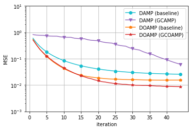

---
# ユニタリ不変行列
<!---
_class: split
_header: 数値シミュレーション
-->

## 通信コスト比
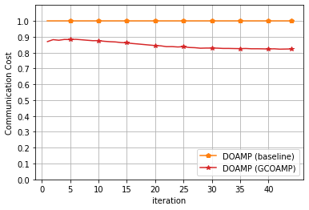

## MSE
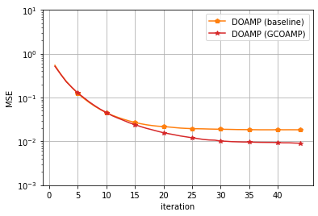

---
# MSEが小さくなる要因
<!--
_class: split
-->

## 予想
- $\bm{b}^t$と$\bm{w}^t$の値が異なる
- 値が異なる部分は閾値$\hat{\tau}_t$未満と見なされた成分
- その部分が小さくなる要因になっているのではないか
- $\mathrm{diff} = \bm{w}^t - \bm{b}^t$
- $\mathrm{diff} \neq 0$となる成分はGCOAMPより$\hat{\tau}_t$未満である可能性が高い

## 検証

- 以下のような予測値と真の値を用意し四つのケースに分類する
- 予測値: $\mathrm{diff} \neq 0$ or $\mathrm{diff} = 0$
- 真の値: $x \neq 0$ or $x = 0$
- 前述の問題設定と$P = 2, 10$で検証

---
# i.i.d.ガウス行列(P=2)
<!--
_class: split
-->

## 比率
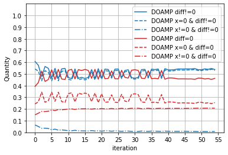

## ケースごとのMSE
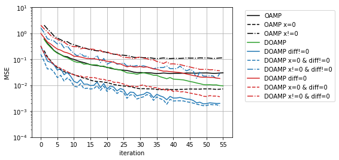

---
# i.i.d.ガウス行列(P=10)
<!--
_class: split
-->

## 比率
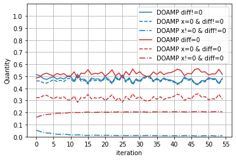

## ケースごとのMSE
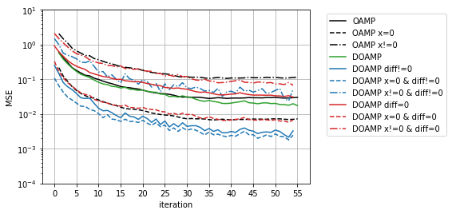

---
# $\mathrm{diff} \neq 0 ~\mathrm{and}~ x = 0$
<!--
_class: split
-->

## $\color{blue}\bm{w}^t$と$\color{orange}\bm{b}^t$と$\color{red}\hat{\tau}_t$
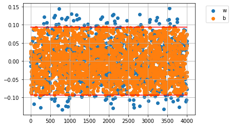

## ヒストグラム
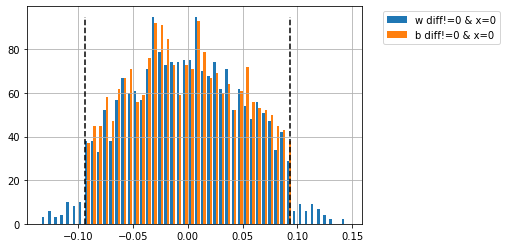

---
# さらなる検証
- $\bm{s}^{t+1}_{\bm{w}} = C(\eta_\mathrm{soft}(\bm{w}^t) - \mathrm{E}\{\eta_\mathrm{soft}'(\bm{w}^t)\}\cdot \bm{w}^t)$
- $\bm{s}^{t+1}_{\bm{b}} = C(\eta_\mathrm{soft}(\bm{b}^t) - \mathrm{E}\{\eta_\mathrm{soft}'(\bm{b}^t)\}\cdot \bm{b}^t)$

- $\bm{s}^{t+1}_{\bm{w}} - \bm{s}^{t+1}_{\bm{b}} = \left\{\begin{array}{ll}
	C\{(\bm{w}^t - \bm{b}^t) - \mathrm{E}\{\eta_\mathrm{soft}'(\bm{w}^t)\}\cdot (\bm{w}^t - \bm{b}^t) \} & \hat{\tau}_t < |\bm{w}^t| \\
	-C \mathrm{E}\{\eta_\mathrm{soft}'(\bm{w}^t)\}\cdot (\bm{w}^t - \bm{b}^t) & \hat{\tau}_t \ge |\bm{w}^t| 
	\end{array}
	\right.$

- $\mathrm{diff} \neq 0 ~\mathrm{and}~ x = 0$のケースに当てはまる成分に対して
$\mathrm{diff} = \bm{w}^t - \bm{b}^t$の大きさを以下のケースに分けて観察
	- $\bm{w}^t \le -\hat{\tau}_t$: 負の値が多いと$\bm{s}^{t+1}_{\bm{b}}$が$\bm{s}^{t+1}_{\bm{w}}$より小さい
	- $\hat{\tau}_t < \bm{w}^t \le \hat{\tau}_t$: 影響なし
	- $\hat{\tau}_t < \bm{w}^t$: 正の値が多いと$\bm{s}^{t+1}_{\bm{b}}$が$\bm{s}^{t+1}_{\bm{w}}$より小さい

---
# i.i.d.ガウス行列(P=2)
<!--
_class: split
-->

## $\bm{w}^t \le -\hat{\tau}_t$
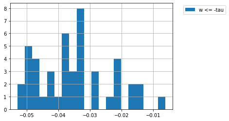

## $-\hat{\tau}_t < \bm{w}^t \le \hat{\tau}_t$
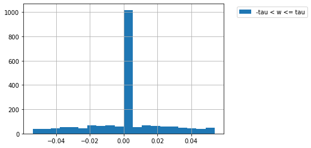

---
# i.i.d.ガウス行列(P=2)
<!--
_class: split
-->

## $\hat{\tau}_t < \bm{w}^t$
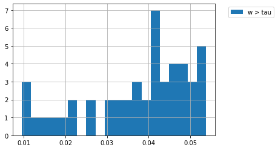

## まとめ
- $\mathrm{diff} \neq 0 ~\mathrm{and}~ x = 0$のMSEが小さく, 割合が多くを占めている
- GCOAMPは閾値$\hat{\tau}_t$未満の$\bm{w}^t$を小さくする働きがある
- GCOAMPを組み合わせたDOAMPは$\mathrm{diff} \neq 0 ~\mathrm{and}~ x = 0$

---
# 今後の課題
<!--
_class: page
-->

- 論文執筆
- 完全分散型の圧縮センシング
- 深層展開