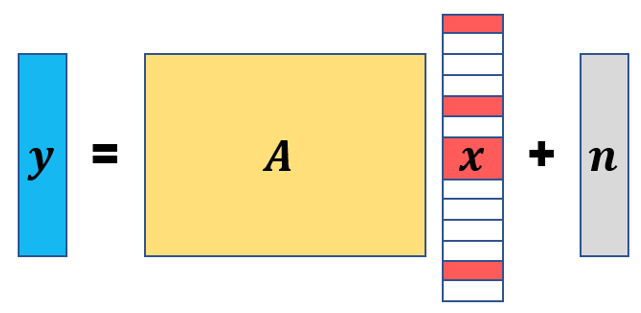

<!--
paginate: true
-->

<!--
_class: title
-->
# Distributed OAMP
## 修論: 完全に分散したOAMP

### 久永 健
#### 2022-08-30
<!-- 
[Ctrl] + [Alt] + [Shift] + [i]
で"Insert Date String"を用いて年月日を挿入できる. 
-->

---
# もくじ

1. 完全分散的な圧縮センシング
2. DAMP with Summation Propagation
3. 提案手法: DOAMP with Summation Propagation

---
# 圧縮センシング
<!-- 
_class: split
_header: '完全分散的な圧縮センシング'
-->

## 

原信号 $\bm{x}$を観測信号 $\bm{y} = \bm{Ax} + \bm{n}$から
復元する問題. 

- 原信号: $\bm{x} \in \mathbb{R}^N$ 
- 観測行列: $\bm{A} \in \mathbb{R}^{M \times N} (M < N)$
- 観測信号: $\bm{y} \in \mathbb{R}^M$
- 観測雑音: $\bm{n} \in \mathbb{R}^M \sim \mathcal{N}(\bm{0}, \sigma^2 \bm{I})$

劣決定な連立一次方程式の解は無限個

$$||$$

$~~~~~~~~~$ 解$\bm{x}$を一意に定められない

   

$\bm{x}$が**疎**であるなら,  精度の高い推定解$\hat{\bm{x}}$を得られる

---
# 分散圧縮センシング
<!--
_class: 'split'
_header: '完全分散的な圧縮センシング'
-->

## 

$P$個の観測ノードで原信号を観測し, 
各観測信号$\bm{y}_p = \bm{A}_p \bm{x} + \bm{n}_p$をもとに
復元する問題. 

- 観測行列: $\bm{A}_p \in \mathbb{R}^{M_p \times N}$
- 観測信号: $\bm{y}_p \in \mathbb{R}^{M_p}$
- 観測雑音: $\bm{n}_p \in \mathbb{R}^{M_p} \sim \mathcal{N}(0, \sigma_p^2 \bm{I})$
	
$$\left[\begin{array}{ll}
	\bm{y}_1 \\
	\vdots \\
	\bm{y}_P
\end{array} \right] =
\left[\begin{array}{ll}
	\bm{A}_1 \\
	\vdots \\
	\bm{A}_P
\end{array} \right]
\bm{x} + 
\left[\begin{array}{ll}
	\bm{n}_1 \\
	\vdots \\
	\bm{n}_P
\end{array} \right]$$

- 周辺ノード: 観測, 簡単な計算を行う
- 中央ノード: 周辺ノードから計算結果を集約し, 再構成解の更新を行う

---
# 完全分散的な圧縮センシング
<!--
_class: 'split'
_header: '完全分散的な圧縮センシング'
_footer: 'k'
-->

## 

$P$個の観測ノードで原信号を観測し, 
各観測信号$\bm{y}_p = \bm{A}_p \bm{x} + \bm{n}_p$をもとに
復元する問題. 

- 観測行列: $\bm{A}_p \in \mathbb{R}^{M_p \times N}$
- 観測信号: $\bm{y}_p \in \mathbb{R}^{M_p}$
- 観測雑音: $\bm{n}_p \in \mathbb{R}^{M_p} \sim \mathcal{N}(0, \sigma_p^2 \bm{I})$
	
$$\left[\begin{array}{ll}
	\bm{y}_1 \\
	\vdots \\
	\bm{y}_P
\end{array} \right] =
\left[\begin{array}{ll}
	\bm{A}_1 \\
	\vdots \\
	\bm{A}_P
\end{array} \right]
\bm{x} + 
\left[\begin{array}{ll}
	\bm{n}_1 \\
	\vdots \\
	\bm{n}_P
\end{array} \right]$$

- P個のノードからなる無向グラフ$G$
- 各ノード$p$は辺でつながった近傍ノード$\mathcal{N}_p$のみと直接通信可能

---
# 合意伝搬法[1]
<!--
_class: 'page'
_header: 'DAMP with Summation Propagation'
_footer: '[1] C. C. Moallemi and B. V. Roy, “Consensus propagation,” IEEE Trans. Inf. Theory, vol. 52, no. 11, pp. 4753–4766, Nov. 2006.'
-->

- ノード$p$における初期値$c_p \in \mathbb{R}$を用いて, 各ノードでの局所的な計算, ノード間の通信によりすべてのノードの初期値の平均$\mu = \frac{1}{P} \sum_{p=1}^P c_p$を計算する. 
- 各ノード$p$に対し, 以下の更新を$T'$回繰り返す. 
$$\nu_{p \to j}^{t'} = \frac{c_p + \sum_{i \in \mathcal{N}_p \backslash j} \iota_{i \to p}^{t'-1} \nu_{p \to j}^{t'-1}}{1 + \sum_{i \in \mathcal{N}_p \backslash j} \iota_{i \to p}^{t'-1}} ~~~~~~~~~~ \iota_{p \to j}^{t'} = 1+ \sum_{i \in \mathcal{N}_p \backslash j} \iota_{i \to p}^{t'-1}$$

これにより, ノード$p$における平均$\mu$の推定値$\hat{\mu}$は
$$\hat{\mu}_p = \frac{c_p + \sum_{i \in \mathcal{N}_p} \iota_{i \to p}^{T'} \nu_{p \to j}^{T'}}{1 + \sum_{i \in \mathcal{N}_p} \iota_{i \to p}^{T'}}$$

---
# DAMP with Summation Propagation[2]
<!--
_class: 'split'
_header: 'DAMP with Summation Propagation'
_footer: '[2] R.Hayakawa, A.Nakai, and K.Hayashi, "Distributed approximate message passing with summation propagation, " in Proc. IEEE ICASSP, April. 2018'
-->

## 更新式
- $\bm{r}_p^t = \bm{y}_p - \bm{A}_p \bm{s}_p^t + \frac{\|\bm{s}_p^t\|_0}{M} \cdot \bm{r}_p^{t-1}$
- $\bm{w}_p^t = \frac{\bm{s}_p^t}{P} + \frac{1}{M} \bm{A}^{\mathsf{T}} \bm{r}_p^t$
- $\bm{s}_p^{t+1} = \eta_\mathrm{soft}(\sum_{p=1}^P \bm{w}_p^t; \hat{\tau}_t)$

## 状態発展法
- $\hat{\tau}_t^2[p] = \frac{\|\bm{r}_p^t\|_2^2}{MN}$
- $\hat{\tau}_t^2 = \sum_{p=1}^P \hat{\tau}_t^2[p]$

## 総和伝搬法
$\xi_{i \to p}^{t'} := \iota_{i \to p}^{t'} \nu_{p \to j}^{t'}$とおくと, 

$$\xi_{p \to j}^{t'} = c_p + \sum_{i \in \mathcal{N}_p \backslash j} \xi_{i \to p}^{t'-1}$$

$T'$回繰り返すと, 求めたい総和$\sum_{p=1}^P c_p$の推定値$\hat{C}_p$を以下で計算できる. 
$$\hat{C}_p = c_p + \sum_{i \in \mathcal{N}_p} \xi_{i \to p}^{T'}$$

---
# DOAMP with Summation Propagation
<!--
_class: 'split'
_header: '提案手法: DOAMP with Summation Propagation'
-->

## 更新式
- $\bm{r}_p^t = \bm{y}_p - \bm{A}_p \bm{s}_p^t$
- $\bm{w}_p^t = \frac{\bm{s}_p^t}{P} + \frac{1}{M} \bm{W}^{t} \bm{r}_p^t$
- $\bm{s}_p^{t+1} = \eta_\mathrm{df}(\sum_{p=1}^P \bm{w}_p^t; \hat{\tau}_t)$
- $\bm{s}_p^{out} = \eta_\mathrm{out}(\sum_{p=1}^P \bm{w}_p^{last}; \hat{\tau}_{last})$

## 状態発展法
- $\hat{\tau}_t^2[p] = \frac{\|\bm{r}_p^t\|_2^2}{MN}$
- $\hat{\tau}_t^2 = \sum_{p=1}^P \hat{\tau}_t^2[p]$

## 総和伝搬法
$\xi_{i \to p}^{t'} := \iota_{i \to p}^{t'} \nu_{p \to j}^{t'}$とおくと, 

$$\xi_{p \to j}^{t'} = c_p + \sum_{i \in \mathcal{N}_p \backslash j} \xi_{i \to p}^{t'-1}$$

$T'$回繰り返すと, 求めたい総和$\sum_{p=1}^P c_p$の推定値$\hat{C}_p$を以下で計算できる. 
$$\hat{C}_p = c_p + \sum_{i \in \mathcal{N}_p} \xi_{i \to p}^{T'}$$

---
# 課題
<!--
_class: page
-->

- 手法の実装
- 数値実験
- 論文執筆